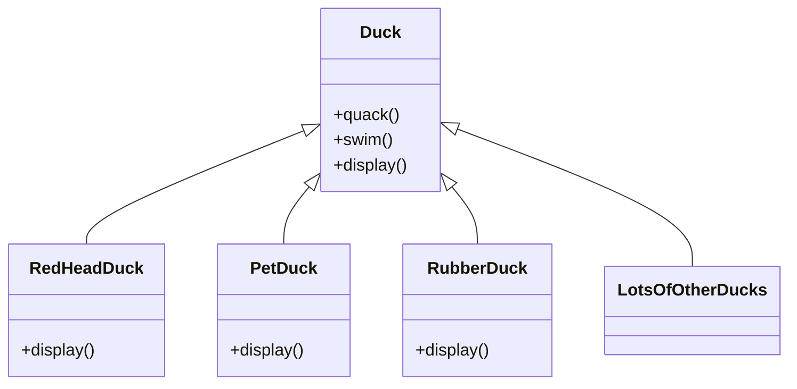

#  <!-- omit in toc -->

Overview of weather monitor application

# Table of Contents <!-- omit in toc -->

## Initial design

### Initial Class Diagram


### Initial Implementation
```python
from abc import abstractmethod

class Duck():
    def quack(self) -> None:
        print('quack, quack')

    def swim(self) -> None:
        print('I can swim')

    @abstractmethod
    def display(self) -> None:
        raise NotImplementedError


class WildDuck(Duck):
    def display(self) -> None:
        print('I am a wild duck')

class PetDuck(Duck):
    def display(self) -> None:
        print('I am a pet duck')

class RubberDuck(Duck):
    def display(self) -> None:
        print('I am a rubber duck')

```

#### [SOLID](https://www.baeldung.com/solid-principles):
- S - Single-responsiblity Principle
  - A class should have one and only one reason to change, meaning that a class should have only one job.
- O - Open-Closed Principle
  - Objects or entities should be open for extension but closed for modification
- L - Liskov Substitution Principle
  - Every subclass or derived class should be substitutable for their base or parent class.
- I - Interface Segregation Principle
  - A client should never be forced to implement an interface that it doesn’t use, or clients shouldn’t be forced to depend on methods they do not use.
- D - Dependency Inversion Principle
  - Entities must depend on abstractions, not on concretions. It states that the high-level module must not depend on the low-level module, but they should depend on abstractions.
