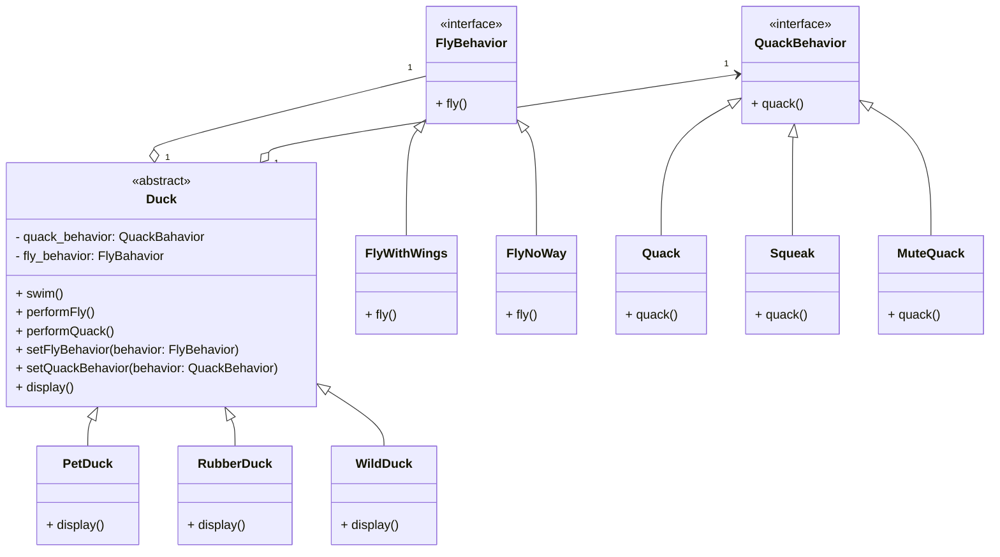

# [Strategy Pattern](https://refactoring.guru/design-patterns/strategy) <!-- omit in toc -->
Lets you define a family of algorithms, put each of them into a separate class, and make their objects interchangeable.

# Table of Contents <!-- omit in toc -->
[TOC]

## References
1. [Strategy Pattern - Refactoring Guru](https://refactoring.guru/design-patterns/strategy)

### Observer Pattern class diagram

### [Excercises](./ducks.md)
