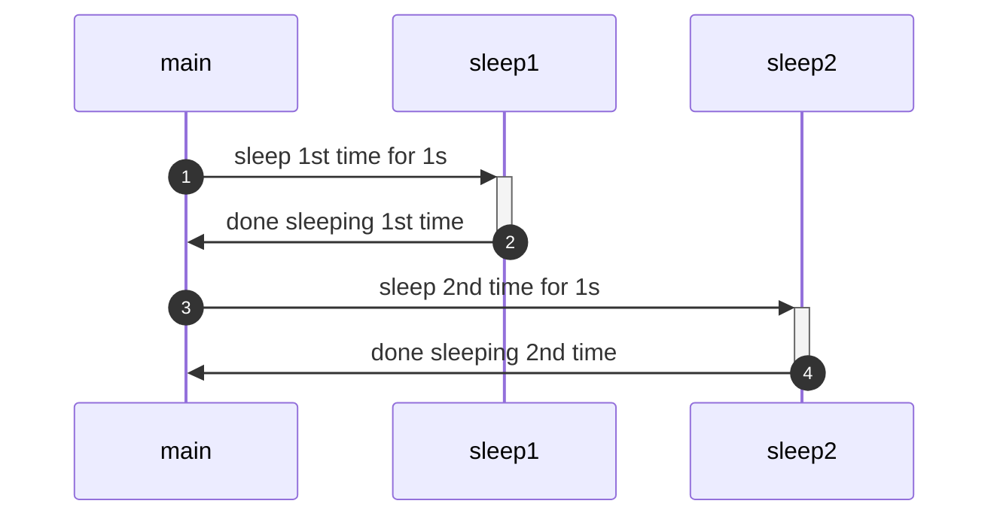
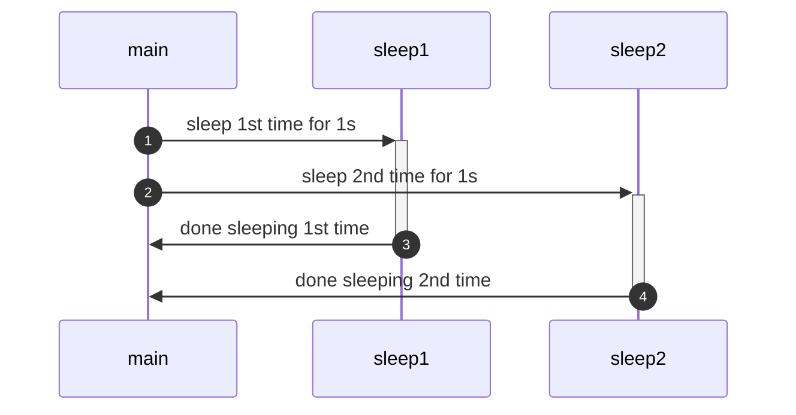

# Multi processing / Multi threading
Overview over multi processing and multi threading

# Table of Contents <!-- omit in toc -->
[TOC]

## Single thread

## Multi threading
Multithreading is a programming concept that allows a single process to execute multiple tasks concurrently, thereby improving the efficiency of the program by utilizing the available CPU resources more effectively.
In a traditional single-threaded program, tasks are executed sequentially, meaning one task has to finish before the next one can start. This can be inefficient, especially in cases where tasks are independent of each other and could potentially execute simultaneously.
Multithreading addresses this issue by allowing multiple threads (lightweight processes) within a single process. Each thread can execute a different task concurrently, thus enabling parallelism and better utilization of CPU cores.

Here are some key concepts associated with multithreading:
1. Thread: A thread is the smallest unit of execution within a process. It represents an independent flow of control within the program. Threads share the same memory space, allowing them to communicate and coordinate with each other.
2. Concurrency: Concurrency refers to the ability of multiple threads to execute simultaneously. In a multithreaded program, threads may run concurrently, but not necessarily in parallel (simultaneously on multiple CPU cores).
3. Parallelism: Parallelism occurs when multiple threads execute simultaneously on multiple CPU cores. Multithreading enables parallelism by allowing tasks to be divided among different threads and executed concurrently.
4. Thread Synchronization: Since threads within a process share the same memory space, it's essential to synchronize their access to shared resources (like variables or data structures) to avoid data corruption or inconsistency. This is typically achieved using synchronization mechanisms such as locks, semaphores, and mutexes.
5. Thread Lifecycle: Threads typically go through various states during their lifecycle, including creation, running, blocked, and terminated. Understanding the thread lifecycle is crucial for managing threads effectively within a multithreaded program.

Multithreading is commonly used in applications where responsiveness and performance are critical, such as graphical user interfaces, web servers, and multimedia processing. However, multithreaded programming can also introduce complexities, such as race conditions, deadlocks, and synchronization overhead, which need to be carefully managed to ensure the correctness and reliability of the program.

## Multi processing

Multiprocessing is a computing paradigm that involves the simultaneous execution of multiple processes, each with its own memory space and resources. Unlike multithreading, where multiple threads within a single process share the same memory space, multiprocessing involves separate processes that may or may not share memory. Each process has its own address space, which means they cannot directly access each other's memory.

Here are some key concepts associated with multiprocessing:
1. Process: A process is an instance of a program that is being executed. Each process has its own memory space, which includes code, data, stack, and other resources. Processes are independent of each other and typically do not share memory, except through explicit inter-process communication mechanisms.
2. Concurrency and Parallelism: Multiprocessing enables both concurrency and parallelism. Concurrency refers to the ability of multiple processes to make progress simultaneously, while parallelism specifically refers to the execution of processes simultaneously on multiple CPU cores.
3. Inter-process Communication (IPC): Since processes have separate memory spaces, they cannot directly share data. IPC mechanisms allow processes to communicate and synchronize with each other. Common IPC mechanisms include pipes, sockets, shared memory, message queues, and signals.
4. Process Creation and Management: Processes are created using system calls or library functions provided by the operating system. The OS is responsible for managing processes, including scheduling them on CPU cores, allocating resources, and handling process termination.
5. Isolation and Fault Tolerance: Multiprocessing provides strong isolation between processes, which enhances fault tolerance and security. If one process crashes or encounters an error, it typically does not affect other processes running on the system.

Multiprocessing is commonly used in scenarios where tasks are inherently independent and can be executed in parallel, such as scientific computing, data processing, web servers, and high-performance computing. It allows for better utilization of modern multi-core CPUs and can significantly improve performance and scalability compared to single-threaded or multithreaded approaches. However, multiprocessing can also introduce overhead due to the need for process creation and IPC, and managing inter-process communication can sometimes be complex.
