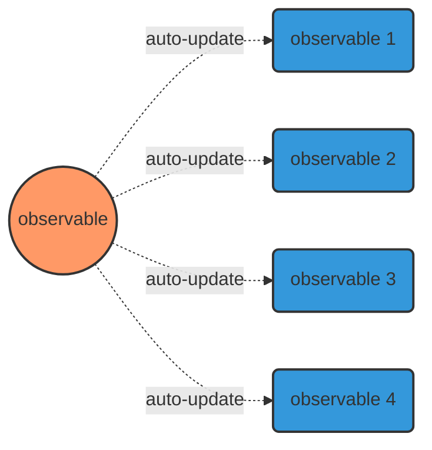
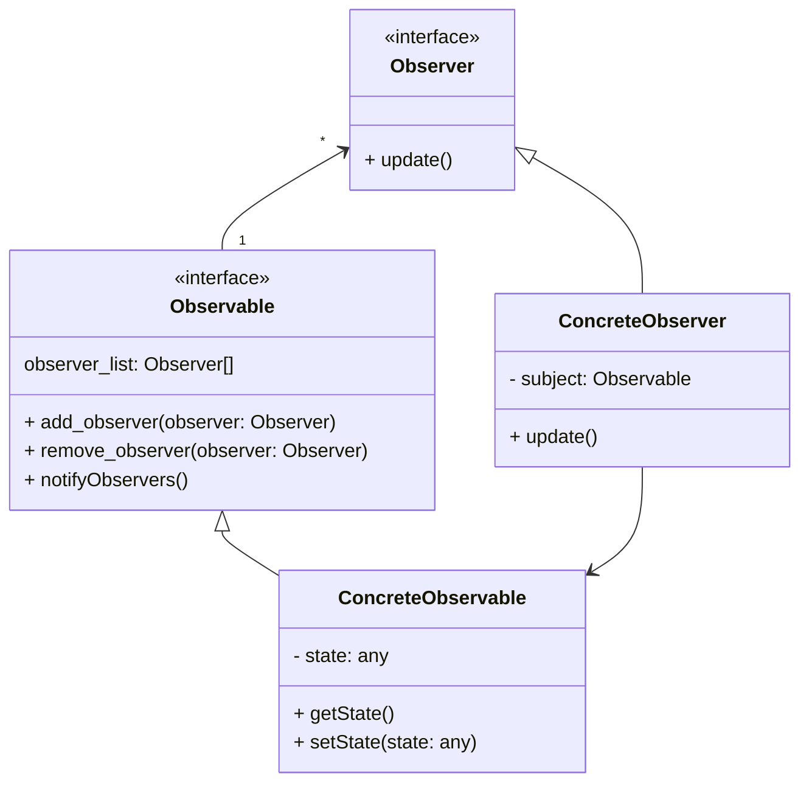

# [Observer Pattern](https://refactoring.guru/design-patterns/observer) <!-- omit in toc -->
Lets you define a subscription mechanism to notify multiple objects about any events that happen to the object they’re observing.

# Table of Contents <!-- omit in toc -->
[TOC]

## References
1. [Observer Pattern - Refactoring Guru](https://refactoring.guru/design-patterns/observer)
2. [ReactiveX - libs for Reactive Programming](https://reactivex.io/)
3. [RxPy - Observable lib for Python](https://rxpy.readthedocs.io/en/latest/)
4. [RxJs - Observable lib for Js/Ts](https://www.learnrxjs.io/)

## Magazine or newspaper subscription
1. A magazine publisher goes into business and begins publishing magazine.
2. You subscribe to a particular publisher, and every time there’s a new edition it gets delivered to you. As long as you remain a subscriber, you get new magazines.
3. You unsubscribe when you don’t want magazines anymore, and they stop being delivered.
4. While the publisher remains in business, people, hotels, airlines, and other businesses constantly subscribe and unsubscribe.

## Observer Pattern definition
Publishers + Subscribers = Observer Pattern
In Observer Pattern Design, publishers are called subjects(or Observables) and subscribers -> Observers

Observer Pattern defines a one to many dependency between objects so that when one object changes state all of its dependents are notified and updated automatically.

## Observer Pattern diagram

## Observer Pattern class diagram

## Loose coupling of Observer Pattern
- The only thing the Observable knows about observer that it implements an observer interface
- observers can be added any time
- observers can be removed any time
- no need to modify Observable to add new type of observers
- Observables and Observers can be reused independently of each other
- changes to the Observable or an Observer will not effect each other as long as we comply to the interfaces defined

## [Excercises](./weather_monitor.md)
