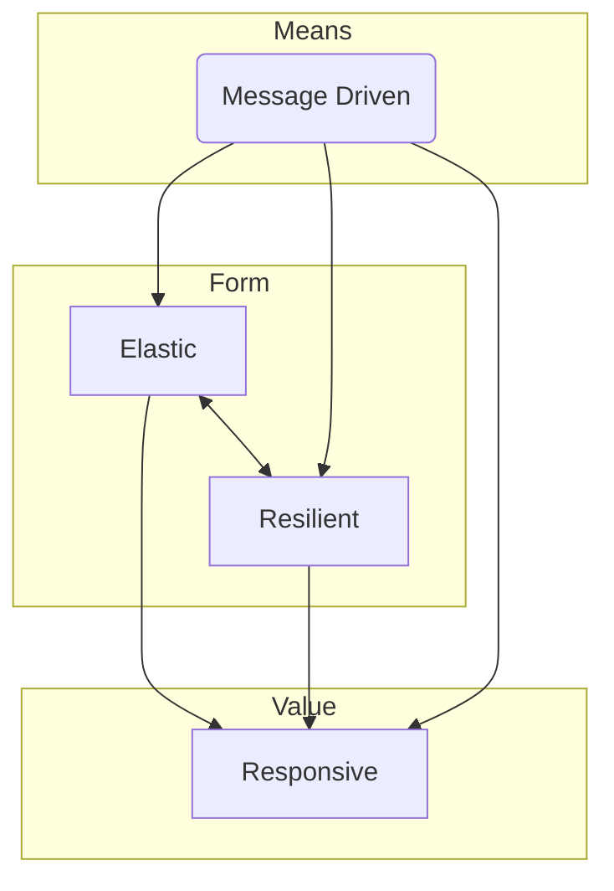
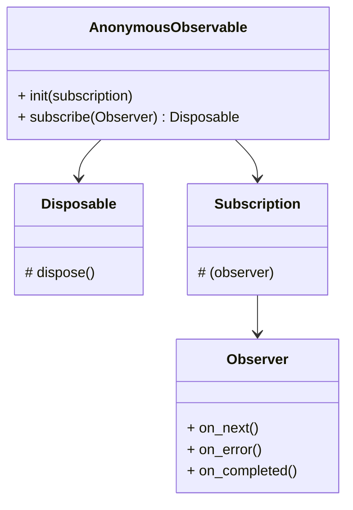
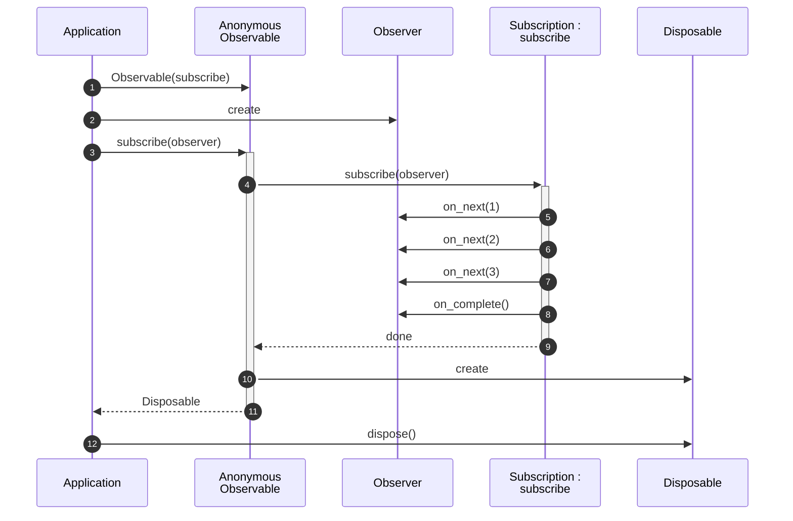

# ReactiveX <!-- omit in toc -->

Overview ReactiveX

# Table of Contents <!-- omit in toc -->
[TOC]

## Reactive systems


- <b>Responsive:</b> It responds to events and user interactions rapidly and consistently. Responsiveness ensures that the application stays usable, and that, in case of a problem, these problems can be detected very quickly and thus handled correctly. Responsiveness is achieved thanks to the three other pillars of a reactive system.
- <b>Resilient:</b> The system stays responsive even in the event of failure. Resilience can be achieved in several ways, such as replication and isolation. Failures are handled and contained in each component. Other components are dedicated to recover the components that failed and replication allows it to provide high-availability.
- <b>Elastic:</b> The system stays responsive when the workload varies. The system can adapt to workloads that increase or decrease so that the allocated resources of the system are not oversized or undersized. In order to provide elasticity, the design must be vertically and horizontally scalable, with no performance bottleneck.
- <b>Message Driven:</b> The different components of the system communicate via asynchronous message channels. Communication via messages allows us to isolate components. Saturation is controlled via back-pressure.


## Advantages / Disadvantages of RxPY
### Advantages of using RxPY
− RxPY is an awesome library when it comes to the handling of async data streams and events. RxPY uses observables to work with reactive programming that deals with asynchronous data calls, callbacks and event-based programs.
- RxPY offers a huge collection of operators in mathematical, transformation, filtering, utility, conditional, error handling, join categories that makes life easy when used with reactive programming.
- Concurrency i.e. working of multiple tasks together is achieved using schedulers in RxPY.
- The performance is improved using RxPY as handling of async task and parallel processing is made easy.

### Disadvantage of using RxPY
- Debugging the code with observables is a little difficult.


## ReactiveX principles
Accessing an asynchronous sequence of items if possible
|              | Single Item | Multiple Items |
| :----------- | :---------- | :------------- |
| Synchronous  | Getter      | Iterable       |
| Asynchronous | Future      | Observable     |

Observables are pushed based
| Event         | Iterable (pull)     | Observable (push) |
| :------------ | :------------------ | :---------------- |
| Retrieve data | For i in Collection | on_next           |
| Error         | Exception is raised | on_error          |
| Complete      | End of Loop         | on_completed      |


## RxPy components




## RxPy dynamics




## Operators
About 140 operators in RxPy
```python
Observable.from_(...)
    .filter()
    .distinct()
    .take(20)
    .map(...)
```

## ReactiveX
- [ReactiveX](https://reactivex.io/)

### RxPy Online tutorials
- [Tutorialpoint](https://www.tutorialspoint.com/rxpy/)
- [ReactiveX](https://rxpy.readthedocs.io/en/latest/)


### RxJs Online tutorials
- [Tutorialpoint](https://www.tutorialspoint.com/rxjs/)
- [RxJs Dev](https://rxjs.dev/guide/overview)
- [Learn RxJs](https://www.learnrxjs.io/)
- [Medium](https://ikehakinyemi.medium.com/explore-reactivex-with-nodejs-and-typescript-7c8636256d74)
