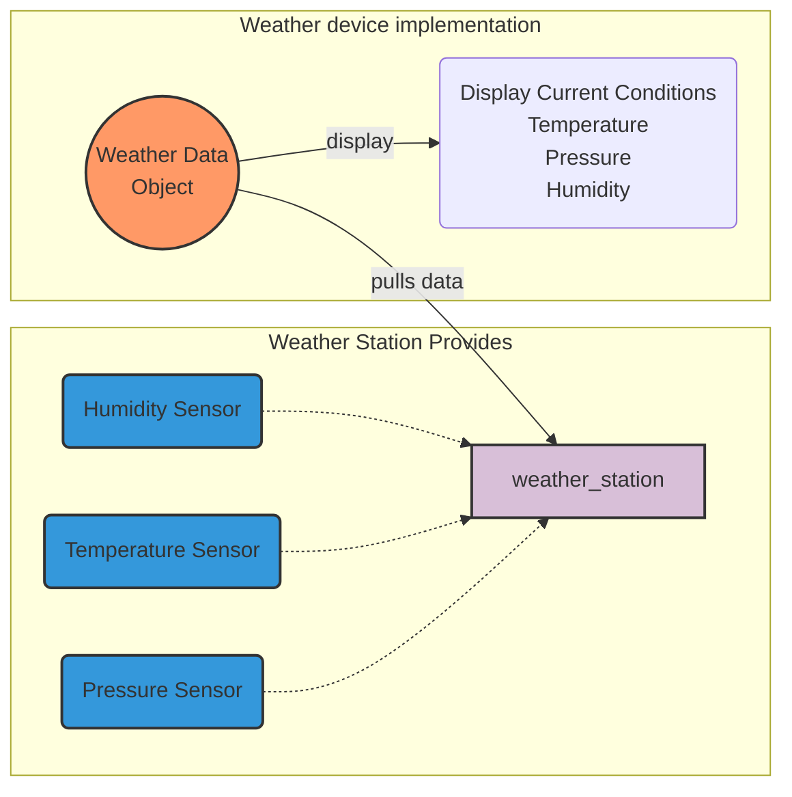
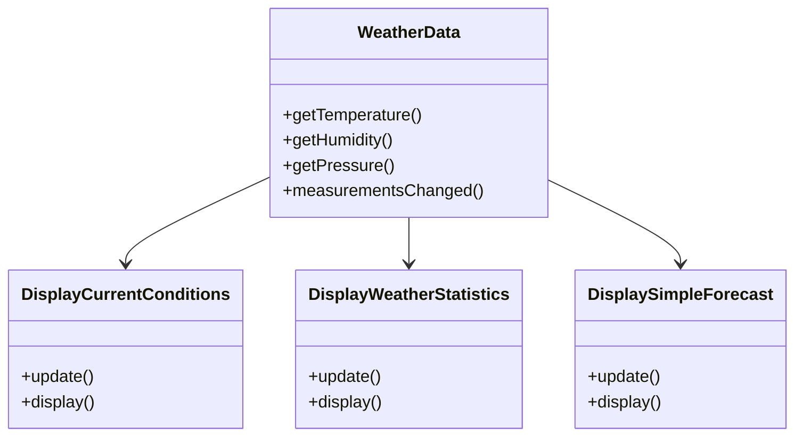

# Weather Monitor <!-- omit in toc -->

Overview of weather monitor application

# Table of Contents <!-- omit in toc -->

## Initial design

### Initial diagram




### Initial Class Diagram


### Initial Implementation
```python
class WeatherData
    def measurements_changed(): -> None:
        temperature = get_temperature()
        humidity = get_humidity()
        pressure = get_pressure()

        # by coding to concrete implementations we have no way to add or remove
        # other display elements without making changes to the API
        current_condition_display.update(temperature, humidity, pressure)
        statistic_display.update(temperature, humidity, pressure)
        forecast_display.update(temperature, humidity, pressure)

```

### Goals are:
- initially 3 displays, but should be expandable in the future
- the API should not be modified when adding a new display
- provide and API, so that other developers can write their own code for other weather displays
- use SOLID principals

#### [SOLID](https://www.baeldung.com/solid-principles):
- S - Single-responsiblity Principle
  - A class should have one and only one reason to change, meaning that a class should have only one job.
- O - Open-Closed Principle
  - Objects or entities should be open for extension but closed for modification
- L - Liskov Substitution Principle
  - Every subclass or derived class should be substitutable for their base or parent class.
- I - Interface Segregation Principle
  - A client should never be forced to implement an interface that it doesn’t use, or clients shouldn’t be forced to depend on methods they do not use.
- D - Dependency Inversion Principle
  - Entities must depend on abstractions, not on concretions. It states that the high-level module must not depend on the low-level module, but they should depend on abstractions.
